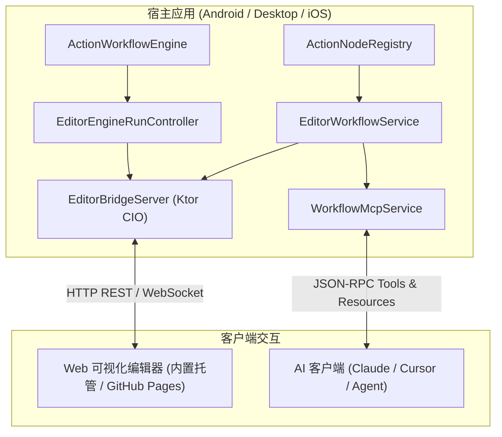

# EditorServer 接入与使用指南

`workflow-editor-bridge` 与 `workflow-editor-mcp` 是专为 `workflow-cmp` 设计的全平台（Kotlin Multiplatform）嵌入式可视化编辑器服务与 AI 桥接库。

基于 **KMP** 与 **Ktor CIO** 高性能异步引擎构建，能够以极低侵入性的方式直接嵌入到 Android、Compose Desktop、iOS 等任意 Kotlin 应用中。

---

## 🌟 核心特性

- 🌐 **全平台通用 (KMP)**：底层基于 Ktor CIO 异步引擎，无 JVM 平台绑定，统一支持 JVM、Android、iOS / Native。
- 📦 **开箱即用内置 Web 编辑器**：静态 Web 资源已内置于库中，服务启动后浏览器访问即可直接使用完整的可视化画布、节点配置、连线及自动排版功能。
- ⚡ **实时双向事件流**：内置 WebSocket 事件通道，实时向浏览器端推送设备状态、节点执行步骤与日志。
- 🤖 **MCP (Model Context Protocol) 支持**：提供 `workflow-editor-mcp` 模块，方便将节点能力与工作流校验/生成工具一键暴露给 AI 助手（如 Cursor、Claude Desktop 等）。
- 🔒 **并发与版本安全**：内置乐观锁修订机制（Revision Control）防止并发保存冲突，支持 Token 鉴权与 CORS 配置。

---

## 📦 依赖引入

在模块的 `build.gradle.kts` 中引入所需模块：

```kotlin
kotlin {
    sourceSets {
        commonMain.dependencies {
            // 核心工作流引擎与节点库
            implementation(projects.workflowCore)
            implementation(projects.workflowNodeAll)

            // 工作流编辑器 Bridge 服务（全平台 HTTP / WebSocket）
            implementation(projects.workflowEditorBridge)

            // 可选：MCP AI 工具服务
            implementation(projects.workflowEditorMcp)
        }
    }
}
```

---

## 🚀 快速开始与接入模版

### 1. 基础服务启动模版

以下代码演示如何在宿主应用中初始化并启动嵌入式 Bridge 服务：

```kotlin
import com.xiaoyv.workflow.editor.bridge.EditorBridgeServer
import com.xiaoyv.workflow.editor.bridge.EditorEngineRunController
import com.xiaoyv.workflow.editor.bridge.contract.EditorDeviceDescriptor
import com.xiaoyv.workflow.editor.bridge.contract.EditorWorkflowService
import com.xiaoyv.workflow.editor.bridge.contract.InMemoryEditorWorkflowRepository
import com.xiaoyv.workflow.editor.bridge.startEditorBridge
import io.ktor.server.cio.CIOApplicationEngine
import io.ktor.server.engine.EmbeddedServer
import kotlinx.coroutines.CoroutineScope
import kotlinx.coroutines.Dispatchers
import kotlinx.coroutines.SupervisorJob
import kotlinx.serialization.json.Json

class MyEditorServerManager(
    private val runtime: WorkflowRuntime, // 包含 registry, validator, engine, editorManifestCodec
    private val sideEffectHandler: ActionSideEffectHandler,
) {
    private var server: EmbeddedServer<CIOApplicationEngine, CIOApplicationEngine.Configuration>? = null

    fun start(host: String = "0.0.0.0", port: Int = 8080) {
        if (server != null) return

        // 1. 构建服务层（可替换为数据库持久化仓库）
        val service = EditorWorkflowService(
            registry = runtime.registry,
            validator = runtime.validator,
            repository = InMemoryEditorWorkflowRepository(),
            manifestCodec = runtime.editorManifestCodec,
        )

        // 2. 构建运行控制器（连接真实执行引擎与事件分发）
        val runController = EditorEngineRunController(
            service = service,
            engine = runtime.engine,
            sideEffectHandler = sideEffectHandler,
            scope = CoroutineScope(Dispatchers.Default + SupervisorJob()),
        )

        // 3. 构建 Bridge 服务实例
        val bridge = EditorBridgeServer(
            service = service,
            device = EditorDeviceDescriptor(name = "My App Workflow Engine"),
            json = Json { ignoreUnknownKeys = true },
            runController = runController,
            accessToken = null, // 若需局域网安全访问可填入配对令牌
        )

        // 4. 启动嵌入式 Ktor CIO 服务器（默认监听 0.0.0.0 支持本设备与局域网设备访问）
        server = startEditorBridge(
            bridge = bridge,
            host = host,
            port = port,
        )
    }

    fun stop() {
        server?.stop(gracePeriodMillis = 1000L, timeoutMillis = 3000L)
        server = null
    }
}
```

启动后在浏览器中打开：

- 本机访问：`http://127.0.0.1:8080`
- 同局域网 PC / 平板访问：`http://<手机或设备IP>:8080`
  即可进入内置的 Web 可视化工作流编辑器。

---

### 2. 自定义持久化仓库 (`EditorWorkflowRepository`)

默认提供内存版本 `InMemoryEditorWorkflowRepository`。如果需要将工作流持久化至 SQLite / Room / 文件系统，只需实现 `EditorWorkflowRepository` 接口：

```kotlin
import com.xiaoyv.workflow.editor.bridge.contract.EditorSaveResult
import com.xiaoyv.workflow.editor.bridge.contract.EditorWorkflowDocument
import com.xiaoyv.workflow.editor.bridge.contract.EditorWorkflowRepository
import com.xiaoyv.workflow.model.definition.ActionWorkflow

class DatabaseWorkflowRepository(private val dao: WorkflowDao) : EditorWorkflowRepository {
    override suspend fun get(id: String): EditorWorkflowDocument? {
        return dao.findById(id)?.toDocument()
    }

    override suspend fun save(
        id: String,
        expectedRevision: Long,
        workflow: ActionWorkflow,
    ): EditorSaveResult {
        val current = get(id)
        if (current != null && current.revision != expectedRevision) {
            return EditorSaveResult.Conflict(current)
        }
        val nextRevision = if (current != null) expectedRevision + 1 else if (expectedRevision <= 0L) 1L else expectedRevision + 1L
        val document = EditorWorkflowDocument(workflow, nextRevision)
        dao.insertOrUpdate(document.toEntity())
        return EditorSaveResult.Saved(document)
    }
}
```

---

### 3. 接入 MCP 赋能 AI

`workflow-editor-mcp` 提供了标准的 MCP 协议实现，可直接处理来自 AI 客户端的 JSON-RPC 指令：

```kotlin
import com.xiaoyv.workflow.editor.mcp.EditorMcpRunGateway
import com.xiaoyv.workflow.editor.mcp.WorkflowMcpService
import com.xiaoyv.workflow.editor.mcp.WorkflowMcpStdioServer

// 初始化 MCP 领域服务
val mcpService = WorkflowMcpService(
    workflowService = service,
    json = json,
    architecture = "# Workflow Architecture Documentation",
    runGateway = EditorMcpRunGateway(runController),
)

val mcpServer = WorkflowMcpStdioServer(mcpService, json)

// 处理单行 JSON-RPC 请求
val responseJson = mcpServer.handle(requestLine)
```

支持的 MCP Tools 与 Resources 包含：

- `workflow_validate`: 校验生成的工作流图与端口连线规则；
- `list_node_types` / `get_node_spec`: 获取注册的节点 Spec、端口与配置定义；
- `workflow_create` / `workflow_update` / `workflow_get`: 工作流读写与乐观锁版本控制；
- `workflow_run` / `run_cancel` / `run_get_status`: 设备端工作流调试与运行状态监控。

---

## 🏛 整体架构概览



---

## 🌐 在线与本地体验

- **GitHub Pages 在线访问**：[https://xiaoyvyv.github.io/workflow-cmp/](https://xiaoyvyv.github.io/workflow-cmp/)
- **本地启动体验**：运行任意 Demo 宿主应用（如 `:desktopApp` 或 `:androidApp`），在浮窗中启动服务，直接在浏览器中打开 `http://127.0.0.1:8080` 或在页面顶部填入设备 IP 地址连接。

---

## 📚 常用 REST & WebSocket API 速查

所有 API 路径统一带有 `/api/v1` 版本前缀：

| 路径                            | 方法          | 说明                          |
|-------------------------------|-------------|-----------------------------|
| `/`                           | `GET`       | 托管内置 Web 可视化编辑器静态页面         |
| `/api/v1/device`              | `GET`       | 获取当前设备描述信息                  |
| `/api/v1/manifest`            | `GET`       | 获取当前所有已注册节点定义的 Manifest 清单  |
| `/api/v1/workflows/{id}`      | `GET`       | 读取指定 ID 的工作流文档与修订版本号        |
| `/api/v1/workflows/{id}`      | `PUT`       | 保存工作流（自动校验 + 乐观锁版本并发控制）     |
| `/api/v1/workflows/validate`  | `POST`      | 校验工作流合法性（节点存在性、端口连线类型与数量约束） |
| `/api/v1/workflows/{id}/runs` | `POST`      | 请求设备执行指定工作流版本               |
| `/api/v1/runs/{runId}`        | `GET`       | 获取当前执行状态与事件日志记录             |
| `/api/v1/runs/{runId}/cancel` | `POST`      | 请求取消当前执行中的任务                |
| `/api/v1/events`              | `WebSocket` | 双向实时事件推送通道（设备状态、运行事件日志）     |
